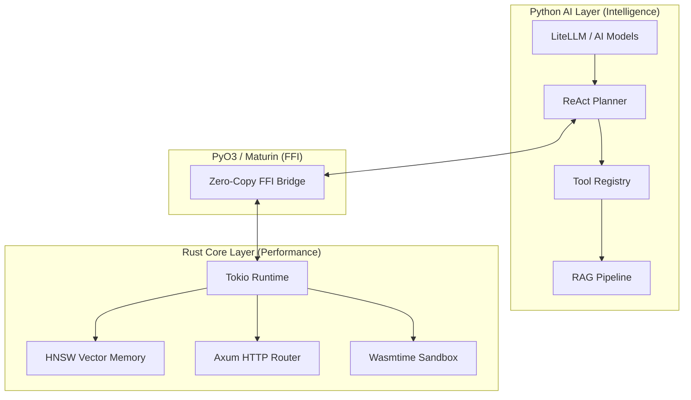

# 🌊 Seahorse Agent

**High-Performance AI Agent Framework — Rust Core + Python Intelligence.**

[](https://www.rust-lang.org/)
[](https://www.python.org/)
[](https://opensource.org/licenses/MIT)

Seahorse is a hybrid AI agent framework designed for speed, safety, and flexibility. It combines the raw performance and memory safety of **Rust** with the rich AI ecosystem of **Python** via a zero-cost FFI bridge.

---

## 🚀 Key Features

- **⚡ Blazing Fast Routing**: Sub-1ms agent routing latency powered by Tokio and Axum.
- **🧠 Vector Memory**: Native Rust HNSW (Hierarchical Navigable Small World) index for lightning-fast RAG (< 5ms search).
- **🛡️ Secure Tooling**: Memory-safe tool execution using **Wasmtime** sandboxing.
- **🤖 Unified AI Logic**: Easy-to-use Python layer supporting **LiteLLM** (Claude, GPT, Gemini, and more).
- **🌊 Native Streaming**: End-to-end async streaming from Rust core to your frontend.
- **🏗️ Industrial Grade**: Type-safe FFI using PyO3 and deterministic dependency management with `uv`.

---

## 🏗️ Architecture

Seahorse uses a multi-layered architecture to maximize both developer productivity and runtime performance.



---

## 🛠️ Getting Started

### Prerequisites

- **Rust**: 1.75+
- **Python**: 3.11+
- **uv**: Modern Python package manager

### Quick Setup

1. **Clone the repository**:

   ```bash
   git clone https://github.com/HakimIno/seahorse.git
   cd seahorse
   ```

2. **Setup Python environment**:

   ```bash
   uv sync
   ```

3. **Build the FFI bridge**:

   ```bash
   uv run maturin develop --features pyo3/extension-module
   ```

4. **Run the development server**:
   ```bash
   uv run uvicorn seahorse_api.main:app --reload
   ```

---

## 📦 Directory Structure

- `crates/seahorse-core`: Core task scheduling, HNSW memory, and Wasm runtime.
- `crates/seahorse-router`: Axum-based API gateway and streaming logic.
- `crates/seahorse-ffi`: PyO3 bindings for zero-copy communication.
- `python/seahorse_ai`: The "brain" — LLM orchestration, planning, and tools.
- `python/seahorse_api`: FastAPI controllers and agent endpoints.

---

## 🧪 Testing

### Rust Core

```bash
cargo nextest run --workspace
```

### Python AI

```bash
uv run pytest python/tests/
```

---

## 📜 License

Seahorse is released under the [MIT License](LICENSE).

---

<p align="center">
  Built with ❤️ by the Seahorse Community.
</p>
