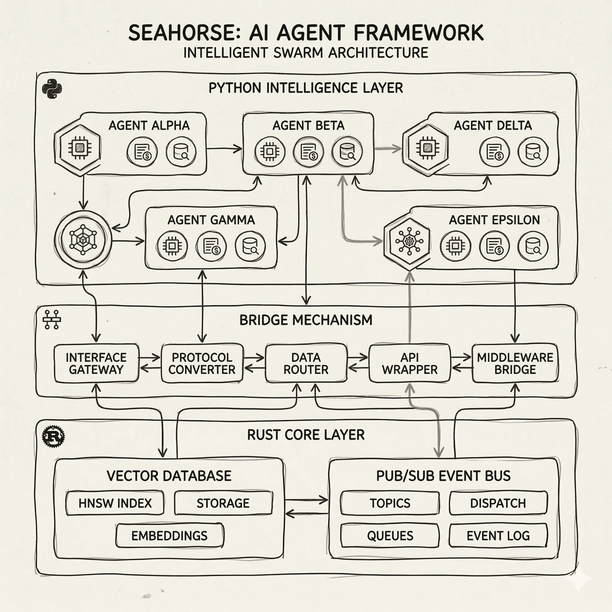

<div align="center">
  
  <h1>Seahorse Agent</h1>
  <p><strong>The High-Performance, Real-Time Multi-Agent Orchestration Framework</strong></p>

  <p>
    <a href="https://www.rust-lang.org/"></a>
    <a href="https://www.python.org/"></a>
    <a href="https://opensource.org/licenses/MIT"></a>
  </p>

  <div style="width: 100%; height: 2px; margin: 20px 0; background: linear-gradient(90deg, transparent, #00d9ff, transparent);"></div>

  <a href="#-quick-start" style="text-decoration: none;">
    
  </a>
</div>

## Overview

Seahorse is a next-generation AI agent framework engineered for enterprise-grade performance, safety, and scalability. By bridging the raw speed of **Rust** with the rich intelligence of **Python**, Seahorse enables true parallel collaboration among agents in a real-time, event-driven architecture.

Unlike traditional hierarchical agents, Seahorse utilizes a high-performance Pub/Sub message bus to facilitate asynchronous swarm collaboration, eliminating blocking bottlenecks and maximizing throughput.

---

## Key Pillars

### Real-Time Swarm Orchestration

Move beyond synchronous delegation. Seahorse agents communicate over a **Rust-powered event-driven bus**, allowing scouts, commanders, and workers to collaborate in parallel.

- **Sub-ms Latency:** Native message routing with zero-copy communication.
- **Event-Driven:** Reactive architecture that responds to environment changes in real-time.

### Hybrid RAG & Long-Term Memory

Experience intelligence that never forgets. Seahorse integrates a dual-memory system for superior retrieval accuracy.

- **Vector Search (HNSW):** Blazing fast similarity search powered by Rust.
- **Knowledge Graph:** Capture complex relationships for deep contextual reasoning.

### Secure Tool Sandboxing

Deploy with confidence. Seahorse executes untrusted tool code within a **Wasmtime-sandboxed environment**, ensuring host isolation and memory safety.

---

## Technical Architecture

Seahorse leverages a hybrid stack designed for speed and flexibility. The system distinguishes between the high-level orchestration in Python and the performance-critical core in Rust.

<div align="center">
  
  <p><i>Figure 1: High-level System Architecture</i></p>
</div>

### Multi-modal Knowledge Grounding

The pipeline supports sophisticated content parsing and graph-based grounding for diverse data types.

<div align="center">
  
  <p><i>Figure 2: Multi-modal RAG Pipeline Workflow</i></p>
</div>

---

## Quick Start

### Prerequisites

- **Rust** 1.75+
- **Python** 3.11+
- **uv** (Ultra-fast package manager)

### Installation

1. **Clone & Sync**

   ```bash
   git clone https://github.com/HakimIno/seahorse.git
   cd seahorse
   uv sync
   ```

2. **Build FFI Core**

   ```bash
   uv run maturin develop -m crates/seahorse-ffi/Cargo.toml
   ```

3. **Run Server**
   ```bash
   ./dev.sh
   ```

---

## Enterprise Verification

Seahorse maintains a rigorous testing standard across both layers:

- **Core Performance:** `cargo nextest run`
- **Intelligence Layer:** `uv run pytest python/tests/`

---

<div align="center">
  <p>Built for the next wave of autonomous agents.</p>
  
</div>
