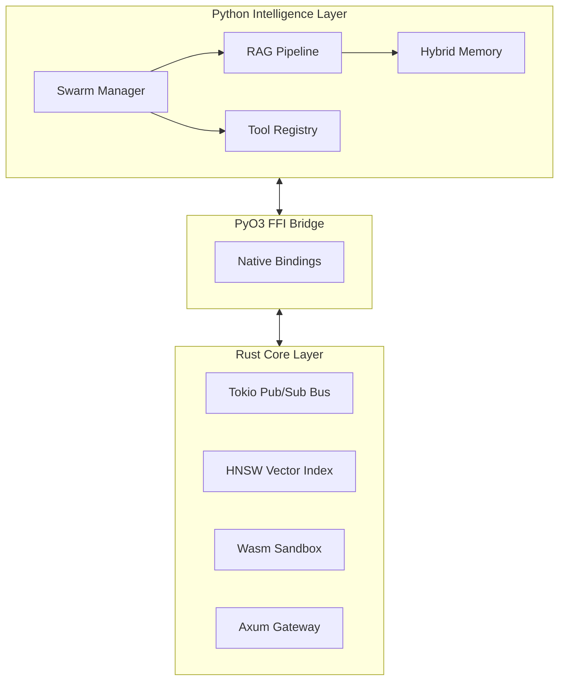

<p align="center">
  
</p>

<h1 align="center">Seahorse</h1>

<p align="center">High-Performance Multi-Agent Orchestration Framework</p>

<p align="center">
  <a href="https://www.rust-lang.org/"></a>
  <a href="https://www.python.org/"></a>
  <a href="https://opensource.org/licenses/MIT"></a>
</p>

---

## Overview

Seahorse is an AI agent framework built for **performance, safety, and scalability**. It bridges a **Rust core** with a **Python intelligence layer** via PyO3 FFI, enabling true parallel agent collaboration through an event-driven pub/sub architecture.

Unlike traditional hierarchical systems, agents in Seahorse communicate asynchronously over a native message bus — eliminating blocking bottlenecks and enabling real-time swarm coordination.

---

## Architecture



---

## Core Features

**Real-Time Swarm Orchestration**
Agents communicate over a Rust-powered event bus with sub-millisecond latency and zero-copy message routing. Scouts, commanders, and workers run in parallel without synchronous delegation overhead.

**Hybrid RAG & Long-Term Memory**
Dual-memory system combining HNSW vector search (Rust-native) with a knowledge graph (Subject-Predicate-Object triples) for high-accuracy contextual retrieval.

**Secure Tool Sandboxing**
Untrusted tool code executes inside a Wasmtime sandbox — host-isolated with full memory safety guarantees.

**Analytics & Visualization**
Built-in support for SQL analytics, predictive forecasting, and automated chart generation (bar, line, pie) with multi-language output.

---

## Agent Types & Roles

Seahorse organizes agents into three distinct roles within a swarm. Each role subscribes to specific message channels on the pub/sub bus and operates concurrently.

| Role          | Responsibility                                                                                       |
| ------------- | ---------------------------------------------------------------------------------------------------- |
| **Commander** | Decomposes high-level tasks, assigns subtasks to workers, aggregates results                         |
| **Scout**     | Performs retrieval and research — queries vector memory, knowledge graph, and external tools         |
| **Worker**    | Executes specific subtasks (code generation, data transformation, API calls) inside the Wasm sandbox |

Roles are composable. A single agent can be configured to act as Scout + Worker depending on the task graph. The Swarm Manager (Python layer) handles lifecycle, role assignment, and fault recovery.

---

## Quick Start

**Prerequisites:** Rust 1.75+, Python 3.11+, [uv](https://github.com/astral-sh/uv)

```bash
# Clone and install dependencies
git clone https://github.com/HakimIno/seahorse.git
cd seahorse
uv sync

# Build FFI core
uv run maturin develop -m crates/seahorse-ffi/Cargo.toml

# Start server
./dev.sh
```

---

## Testing

```bash
# Rust core
cargo nextest run

# Python layer
uv run pytest python/tests/
```

---

## Contributing

Contributions are welcome. Please follow these guidelines before opening a PR.

**Branching**
Use descriptive branch names: `feat/`, `fix/`, `docs/`, `chore/` prefixes.

**Code Style**

- Rust: `cargo fmt` + `cargo clippy --all-targets` must pass with no warnings
- Python: `ruff check` + `mypy` must pass clean

**Commits**
Follow [Conventional Commits](https://www.conventionalcommits.org/). Keep commits atomic and focused.

**Pull Requests**

- Link the relevant issue if applicable
- Include tests for new behavior
- Update documentation if the public API changes

For significant changes, open an issue first to discuss the approach before investing in implementation.

---

<p align="center">
  Built for the next wave of autonomous agents.
</p>
