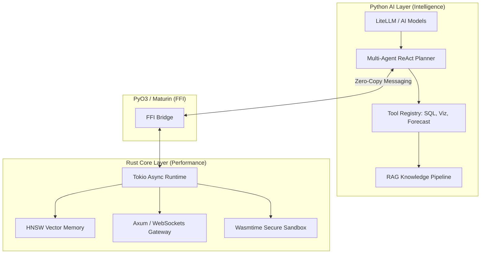

<h1 align="center">🌊 Seahorse Agent</h1>

<p align="center">
  <strong>High-Performance Enterprise AI Agent Framework — Rust Core + Python Intelligence.</strong>
</p>

<p align="center">
  <a href="https://www.rust-lang.org/"></a>
  <a href="https://www.python.org/"></a>
  <a href="https://opensource.org/licenses/MIT"></a>
</p>

---

Seahorse is a hybrid AI agent framework engineered for speed, safety, and enterprise scalability. It combines the raw performance and memory safety of **Rust** with the rich AI tooling ecosystem of **Python** via a zero-cost PyO3 FFI bridge.

## ✨ Key Features

- **⚡ Blazing Fast Routing**: Sub-1ms agent routing latency powered by Tokio and Axum.
- **🧠 Native Vector Memory**: Rust-powered HNSW (Hierarchical Navigable Small World) index for lightning-fast RAG (< 5ms search latency).
- **📊 Business Intelligence & Visualization**: Integrated robust tools for SQL analysis, predictive forecasting, and automated data visualization.
- **🛡️ Secure Tooling**: Memory-safe tool execution using **Wasmtime** sandboxing.
- **🤖 Multi-Agent Orchestration**: Out-of-the-box support for Planner, Thinker, and Worker architectures via **LiteLLM**.
- **🌊 Native Streaming**: End-to-end async text and tool execution streaming from Rust core to your UI or Discord bot.
- **🚨 Proactive Anomaly Detection**: Built-in `AnomalyWatcher` pattern for autonomous monitoring and alert generation.
- **🏗️ Industrial Grade**: Type-safe FFI using PyO3 and deterministic dependency management with `uv`.

---

## 🏗️ Architecture

Seahorse uses a multi-layered architecture to maximize both developer productivity and runtime performance.



---

## 📂 Project Structure

```text
seahorse/
├── crates/             # Rust Workspace
│   ├── seahorse-core   # Core task scheduling, HNSW memory, Wasm runtime
│   ├── seahorse-router # Axum-based API gateway and streaming logic
│   └── seahorse-ffi    # PyO3 bindings for zero-copy communication
├── python/             # Python Workspace (Managed by `uv`)
│   ├── seahorse_ai     # The "brain" — LLM orchestration, planning, tools, and watchers
│   ├── seahorse_api    # FastAPI controllers and REST endpoints
│   └── tests           # Unit tests
├── .env.example        # Environment variable template
├── discord.sh          # Quickstart script for the Discord Bot
└── pyproject.toml      # Dependency management via `uv`
```

---

## 🛠️ Getting Started

### Prerequisites

- **Rust**: 1.75+ (via `rustup`)
- **Python**: 3.11+
- **uv**: The ultra-fast Python package installer and resolver (`pip install uv` or `curl -LsSf https://astral.sh/uv/install.sh | sh`)
- **PostgreSQL**: For database querying tools (optional, but recommended for BI capabilities)

### Local Setup & Installation

1. **Clone the repository**:

   ```bash
   git clone https://github.com/HakimIno/seahorse.git
   cd seahorse
   ```

2. **Configure Environment Variables**:
   Copy the example config and add your API keys.

   ```bash
   cp .env.example .env
   ```

   _Make sure to configure your LLM Provider keys (e.g., `OPENROUTER_API_KEY`) and Database URIs._

3. **Install Python Dependencies**:

   ```bash
   uv sync
   ```

4. **Build the Rust FFI Bridge**:
   Compile the Rust bindings into a native Python module.
   ```bash
   uv run maturin develop --features pyo3/extension-module
   ```

---

## 🎮 Usage

### Running the API Server

Launch the high-performance backend:

```bash
uv run uvicorn seahorse_api.main:app --reload
```

### Running the Discord Bot

Seahorse includes a fully-featured Discord integration with interactive multi-chart rendering and stream-like responses.

```bash
# Ensure DISCORD_BOT_TOKEN is set in your .env
./discord.sh
```

---

## 👨‍💻 Core AI Tools Overview

Seahorse comes pre-equipped with an extensible suite of tools under `seahorse_ai/tools`:

- **Database Expert** (`db.py`): Connects to PostgreSQL to run automated exploratory queries and pull aggregate data safely.
- **Memory Store** (`memory.py`): In-memory RAG pipeline backed by Rust's HNSW vector search to remember long-term interactions.
- **Visual Intelligence** (`viz.py`): Generates professional, data-analyst grade Matplotlib charts (Bar, Line, Pie) with full multi-language support.
- **Predictive Analytics** (`forecaster.py`): Uses basic statistical modeling inside Python to forecast future trends based on historical DB data.
- **Background Watcher** (`watcher.py`): An asynchronous Daemon that monitors data periodically and sends proactive anomalies straight to your Discord channels.

---

## 🧪 Testing

### Rust Core Tests

```bash
cargo nextest run --workspace
```

### Python AI Tests

```bash
uv run pytest python/tests/
```

---

## 🤝 Contributing

Contributions are welcome! Please open an issue or submit a Pull Request.

## 📜 License

Seahorse is released under the [MIT License](LICENSE).

---

<p align="center">
  Built with ❤️ by the Seahorse Community.
</p>
