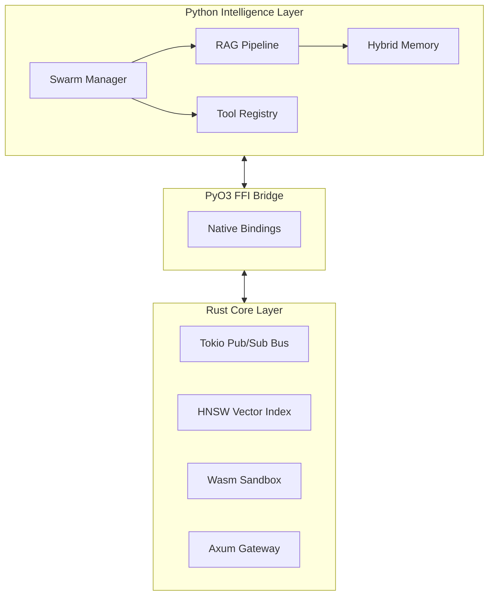

<p align="center">
  
</p>

<h1 align="center">Seahorse Agent</h1>

<p align="center">
  <strong>The High-Performance, Real-Time Multi-Agent Orchestration Framework.</strong>
</p>

<p align="center">
  <a href="https://www.rust-lang.org/"></a>
  <a href="https://www.python.org/"></a>
  <a href="https://opensource.org/licenses/MIT"></a>
</p>

---

## 🌊 Overview

Seahorse is a next-generation AI agent framework engineered for **enterprise-grade performance, safety, and scalability**. By bridging the raw speed of **Rust** with the rich intelligence of **Python**, Seahorse enables true parallel collaboration among agents in a real-time, event-driven architecture.

Unlike traditional hierarchical agents, Seahorse uses a high-performance Pub/Sub message bus to facilitate asynchronous swarm collaboration, eliminating blocking bottlenecks and maximizing throughput.

## 🚀 Key Pillars of Performance

### ⚡ Real-Time Swarm Orchestration

Move beyond synchronous delegation. Seahorse agents communicate over a **Rust-powered event-driven bus**, allowing scouts, commanders, and workers to collaborate in parallel.

- **Sub-ms Latency:** Native message routing with zero-copy communication.
- **Event-Driven:** Reactive architecture that responds to environment changes in real-time.

### 🧠 Hybrid RAG & Long-Term Memory

Experience intelligence that never forgets. Seahorse integrates a dual-memory system for superior retrieval accuracy.

- **Vector Search (HNSW):** Blazing fast similarity search powered by Rust.
- **Knowledge Graph:** Capture complex relationships (Subject-Predicate-Object) for deep contextual reasoning.

### 🛡️ Secure Tool Sandboxing

Deploy with confidence. Seahorse executes untrusted tool code (e.g., generated Python snippets) within a **Wasmtime-sandboxed environment**, ensuring host isolation and memory safety.

### 📊 Professional Analytics & Visualization

Turn raw data into insights. Integrated tools for SQL analytics, predictive forecasting, and automated, analyst-grade chart generation (Bar, Line, Pie) with full multi-language support.

---

## 🏗️ Technical Architecture

Seahorse leverages a hybrid stack designed for speed and flexibility.



---

## 🛠️ Quick Start

- **Rust** 1.75+
- **Python** 3.12+ (managed via `uv` or Nix)
- **Nix** (Optional but recommended for reproducible environments)
- **uv** (Ultra-fast package manager)

### Installation

#### 1. Unified Setup (Recommended)
If you have [Nix](https://nixos.org/) installed, simply run:
```bash
nix develop
```
Or if you use `direnv`, run `direnv allow`. This will set up the correct Rust toolchain, Python 3.12, and all system dependencies (OpenSSL, etc.) automatically.

#### 2. Manual Setup
1.  **Clone & Sync:**

    ```bash
    git clone https://github.com/HakimIno/seahorse.git
    cd seahorse
    uv sync
    ```

2.  **Build FFI Core:**

    ```bash
    uv run maturin develop -m crates/seahorse-ffi/Cargo.toml
    ```

3.  **Run Server:**
    ```bash
    ./dev.sh
    ```

---

## 🧪 Enterprise Verification

Seahorse maintains a rigorous testing standard across both layers:

- **Core Performance:** `cargo nextest run`
- **Intelligence Layer:** `uv run pytest python/tests/`

---

<p align="center">
  Built for the next wave of autonomous agents.
</p>
